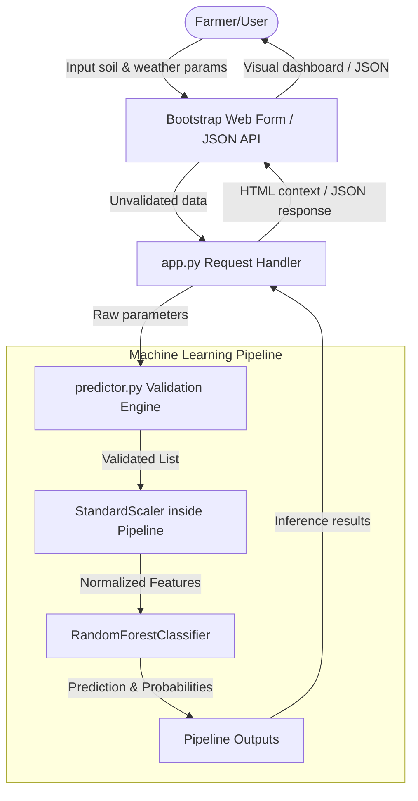
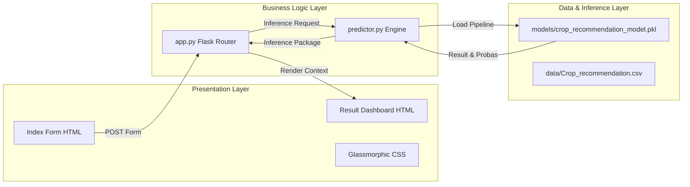

# OptiCrop Project Documentation Notes

This document contains detailed text information structured according to the **AI-ML-and-GEN-AI-Track-Project-Template** phases to assist in producing final project documentation.

---

## 1. Brainstorming & Ideation

### A. Define Problem Statement
*   **The Challenge**: Modern agriculture face issues due to unpredictable climatic shifts and soil degradation. Farmers often rely on traditional intuition, leading to sub-optimal crop selection, over-fertilization, depleted soil nutrients, and lower crop yields.
*   **The Goal**: Develop a data-driven crop recommendation engine that analyzes soil composition (N, P, K, pH) and environmental inputs (temperature, humidity, rainfall) to suggest the most compatible crop, optimizing agricultural yield and resource utilization.

### B. Brainstorming & Idea Prioritization
*   **Why this solution was prioritized**: 
    1.  **High Feasibility**: Relies on widely available agricultural soil test datasets.
    2.  **Immediate Impact**: Direct, actionable crop selections directly translate to better yield, minimized fertilizer costs, and sustainable farming.
    3.  **Low Barrier of Entry**: Standard browser form or lightweight mobile API integration allows it to work in rural settings without high computational requirements.
    4.  **Extensible**: Easily pairs with local IoT soil sensor kits in the future.

### C. Empathy Map
*   **Say**: "I want to maximize my seasonal crop yield without spending a fortune on experimental seeds and fertilizers."
*   **Do**: Manually tests soil parameters, checks climate reports, and makes crop selections based on historical regional trends.
*   **Think**: "Is my soil suited for rice this year, or should I switch to maize? Am I wasting money on phosphorus?"
*   **Feel**: Anxious about weather patterns (rainfall, temperature anomalies) and financial risks of crop failure.

---

## 2. Requirement Analysis

### A. Solution Requirements
*   **Functional Requirements**:
    1.  Accept 7 numeric inputs: Nitrogen (N), Phosphorous (P), Potassium (K), Temperature (°C), Humidity (%), pH, and Rainfall (mm).
    2.  Validate input parameters to ensure they lie within realistic agronomic bounds.
    3.  Load the trained Random Forest classifier and execute inference.
    4.  Expose predictions as an interactive web page and a RESTful JSON endpoint.
*   **Non-Functional Requirements**:
    1.  **Accuracy**: Model must achieve >95% validation accuracy (achieved **99.55%**).
    2.  **Latency**: Prediction inference time under 100 milliseconds.
    3.  **Usability**: Responsive, accessible web design utilizing visual aids (gauges and cards) for result readability.

### B. Technology Stack
*   **Language**: Python 3.10+ (Current target: Python 3.14+)
*   **Web Framework**: Flask (Python backend micro-framework)
*   **Machine Learning**: Scikit-Learn (standard scaler, Random Forest model pipeline), Pandas, NumPy
*   **Data Analysis**: Jupyter Notebook (EDA), Matplotlib, Seaborn
*   **Frontend UI**: HTML5, CSS3, Bootstrap 5, FontAwesome (for icons)
*   **Version Control**: Git & GitHub

### C. Customer Journey Map
1.  **Soil Testing**: Farmer takes soil sample to local lab, obtaining N, P, K ratios and pH.
2.  **Accessing App**: Farmer opens OptiCrop dashboard on a mobile phone or web browser.
3.  **Data Input**: Farmer enters soil metrics and current local climate metrics.
4.  **Inference**: Farmer submits the form; the backend validates metrics, runs the model, and displays results in <1 second.
5.  **Action**: Farmer reads the crop recommendation and reviews alternative match likelihoods to make seed ordering decisions.

### D. Data Flow Diagram (DFD)

---

## 3. Project Design Phase

### A. Problem-Solution Fit
*   **Problem**: High variation in soil composition causes farmers to over-apply fertilizers.
    *   *Solution*: Inputting local N-P-K metrics allows the ML model to evaluate exactly what crops thrive in those nutrient bands.
*   **Problem**: Erratic rainfall patterns impact crop viability.
    *   *Solution*: Incorporating average rainfall metrics ensures water-intensive crops (like rice) are only recommended under high rainfall thresholds.

### B. Proposed Solution
*   A lightweight, modular Flask web service that bridges statistical machine learning models with a premium glassmorphic user dashboard. It handles input cleaning, feature scaling, model scoring, and alternative crop suitability ranking.

### C. Solution Architecture

---

## 4. Project Planning Phase

*   **Milestone 1: Setup & Data Prep**: Init repository, create `.gitignore`, download the 2200-row crop recommendation dataset, and configure virtual environments.
*   **Milestone 2: Model Comparison & Selection**: Implement `model_training.py` comparing KNN, Decision Tree, Logistic Regression, and Random Forest; save the best model pipeline.
*   **Milestone 3: Core Prediction Code**: Build input validation rules and prediction helpers inside `predictor.py`.
*   **Milestone 4: Flask UI Development**: Code Flask routes, write custom CSS (`style.css`), and templates (`index.html`, `result.html`).
*   **Milestone 5: Testing & Refactoring**: Build unit tests (`test_system.py`), verify system endpoints, resolve warnings, and flatten directory structure to the root.

---

## 5. Project Development Phase

### A. Core Code Modules
1.  **`app.py`**: Configures Flask routing. Features conditional response types (returns standard HTML views for browser users, or a detailed JSON object if the caller requests `application/json`).
2.  **`src/predictor.py`**: Manages model loading, input bounds checking, and formats features as a Pandas DataFrame before feeding them to the scikit-learn standardizer.
3.  **`src/model_training.py`**: Standardizes numerical fields, trains 4 classifiers, displays comparative accuracy tables, and saves the pipeline.

### B. Code Quality & Modularity
*   **Readability**: Fully commented codebase using Python Google-style docstrings and explicit type hints.
*   **Reusability**: Preprocessing and classification steps are chained together in a single Scikit-Learn `Pipeline`. The web controller only interacts with the pipeline, making model swaps (e.g., swapping Random Forest for XGBoost) possible without rewriting inference or validation logic.

### C. Functional Features List
1.  Dynamic Input Bounds Validation (guards against invalid negative values or out-of-bounds pH scales).
2.  Pipeline Model Scaling (auto-applies `StandardScaler` fitted on training sets).
3.  Secondary Recommendations (returns a list of alternative match probabilities so the farmer sees the top 4 candidate crops).
4.  Dual HTML Form and REST JSON API endpoints.

---

## 6. Project Testing

### A. Model Accuracy & Metric Evaluation
Model training logs demonstrate the following performance metrics on the test dataset:

| Machine Learning Model | Accuracy | Precision | Recall | F1-Score |
| :--- | :---: | :---: | :---: | :---: |
| **Logistic Regression** | 97.27% | 97.40% | 97.27% | 97.25% |
| **K-Nearest Neighbors** | 97.95% | 98.04% | 97.95% | 97.93% |
| **Decision Tree** | 97.95% | 98.06% | 97.95% | 97.94% |
| **Random Forest** | **99.55%** | **99.57%** | **99.55%** | **99.55%** |

### B. Unit & Integration Testing
The test suite in `src/test_system.py` contains 6 verification routines:
*   `test_dataset_exists`: Validates dataset file availability.
*   `test_model_file_exists`: Validates pickle model generation.
*   `test_valid_prediction`: Tests normal agricultural parameters (accurately predicts `rice` for correct rice parameters).
*   `test_invalid_range_inputs`: Confirms validator blocks incorrect ranges.
*   `test_non_numeric_inputs`: Confirms validator blocks string inputs.
*   `test_predict_proba`: Validates that probability distribution list sums to 1.0 and is sorted descending.

---

## 7. Project Documentation & Demonstration

*   **Executable Files**: Main web dashboard runs via `python app.py` (serving locally on port 5000). Model training runs via `python src/model_training.py`. Tests run via `python src/test_system.py`.
*   **Future Scope**:
    1.  **IoT Integration**: Connect real-time IoT soil sensors (like Arduino NPK sensors) to the Flask JSON API.
    2.  **Dynamic Weather Fetching**: Auto-populate temperature, humidity, and rainfall by querying real-time weather APIs (e.g. OpenWeatherMap API) based on geographic coordinates.
    3.  **Market Price Integration**: Add current crop market pricing index (MSP) to sort recommendations not just by agronomic suitability, but also by economic profitability.
